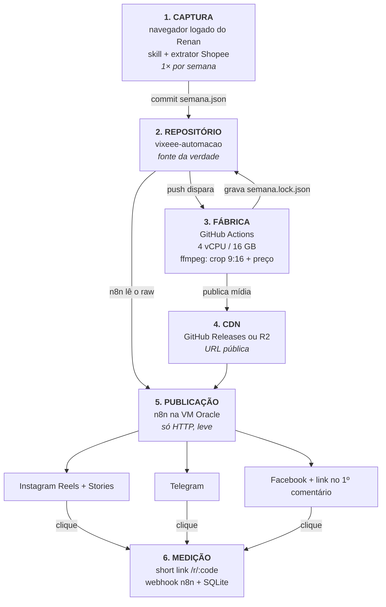

# Plano de Evolução — Vixeee Que Barato

> **Status:** planejamento. Nada implementado.
> **Data:** 19/08/2026 · **Dono:** Renan · **Fuso:** America/Sao_Paulo
> **Objetivo deste documento:** servir de briefing único para retomar/executar a evolução do projeto em qualquer sessão (inclusive no Cowork), sem depender do histórico do chat.

---

## 0. Situação atual — onde cada coisa mora

Antes de qualquer plano, o mapa do que existe hoje. **Este é o principal problema a resolver: o projeto não está versionado em lugar nenhum.**

| Peça | Onde vive hoje | Versionado? | Editável fora da VM? |
|---|---|---|---|
| Workflow n8n (`vixeeepub01`, 23 nós) | dentro do container Docker na VM Oracle | ❌ | ❌ só via SSH |
| Gerador do workflow (`gen_workflow.py`) | arquivo solto no PC | ❌ | ✅ |
| Dados dos produtos (`produtos_semana1.json`) | arquivo solto no PC | ❌ | ✅ |
| Artes (post + story) | repo público `RenanComprovaFacil/vixeee-artes` | ✅ | ✅ |
| Skill de captura Shopee | dentro do Claude | ❌ | parcial |
| Credenciais (IG, Telegram, Meta) | **em texto puro** dentro do JSON do workflow, do `runme_v2.txt` e dos MDs | ❌ | — |
| Documentação (contexto, retomada, deploy) | arquivos soltos no PC, **com nomes trocados** | ❌ | ✅ |

**Fluxo atual:** 7 nós `Set` estáticos (1 produto por dia da semana) → nó `Config` injeta credenciais → 3 ramos paralelos: Telegram `sendPhoto`, IG feed (container → espera 30s → publish), IG story (idem). Cron diário às 19h.

**Infra atual:** Oracle Cloud `VM.Standard.E2.1.Micro` — **1/8 de OCPU** (não 1 OCPU inteiro) e **1 GB de RAM**, região `sa-saopaulo-1`, n8n em Docker, acessível só por túnel SSH.

---

## 1. ⚠️ Correções de premissa — fatos verificados em 19/08/2026

Estes pontos foram checados nas fontes oficiais e **corrigem suposições comuns** (algumas minhas, em conversas anteriores). Ler antes de planejar qualquer coisa.

### 1.1 Oracle Always Free — o Ampere A1 foi cortado pela metade

- A cota gratuita do `VM.Standard.A1.Flex` caiu de **4 OCPU / 24 GB** para **2 OCPU / 12 GB**, efetivo em **15/06/2026**. A Oracle não anunciou publicamente — a mudança apareceu só na documentação.
- 🔴 **Instâncias acima do novo limite seriam terminadas a partir de 18/08/2026.** Se existir algum A1 antigo na conta, **verificar o estado dele agora.**
- ⚠️ Recurso "grandfathered" que for terminado **pode não ser recriável** acima do novo limite.
- A `E2.1.Micro` (a que está em uso) **não foi afetada** — é uma cota separada, até 2 instâncias.

### 1.2 Oracle recupera instâncias ociosas — risco real para a VM atual

A Oracle pode **recuperar** (deletar) instâncias Always Free quando, ao longo de **7 dias**, todas estas condições ocorrem:
- CPU no percentil 95 **abaixo de 20%**
- Uso de rede **abaixo de 20%**
- Uso de memória abaixo de 20% *(este critério vale apenas para shapes A1)*

**Uma VM que só publica 1 post por dia fica confortavelmente abaixo desses limiares.** Isso precisa de mitigação explícita no plano (ver Fase 0).

### 1.3 Oracle — IP efêmero não vira reservado

Não existe conversão de IP efêmero em reservado mantendo o mesmo endereço. É preciso criar um IP reservado novo (**endereço diferente**) e reatribuir. Ou seja: a regra "não parar a instância porque o IP muda" continua valendo até que essa migração seja feita de propósito.

### 1.4 A1 em São Paulo é praticamente inatingível

Relatos de 2026 em `sa-saopaulo-1`: mais de 1.000 tentativas em 3+ dias, todas com *"Out of host capacity"*. Regiões com um único Availability Domain — o caso de São Paulo — são as piores. **Não planejar contando com conseguir um A1.**

### 1.5 GitHub Actions — specs e a pegadinha do ffmpeg

| Item | Repo **público** | Repo **privado** |
|---|---|---|
| Minutos/mês | **ilimitado** | 2.000 |
| Runner `ubuntu-latest` | **4 vCPU / 16 GB RAM** | 2 vCPU / 8 GB RAM |
| Disco | 14 GB | 14 GB |

- ❌ **ffmpeg NÃO vem pré-instalado** nas imagens Ubuntu 22.04 nem 24.04. É obrigatório um step `sudo apt-get install -y ffmpeg` (~20–40s) ou uma action de setup. Qualquer plano que assuma ffmpeg pronto **quebra no primeiro run**.
- `ubuntu-latest` hoje = Ubuntu 24.04.
- ⚠️ Workflows com `schedule:` são **desativados automaticamente após 60 dias sem atividade no repositório**. Só commit/push conta como atividade — issue, comentário e star **não** contam.
- **Arquivo acima de 100 MB é bloqueio duro no Git** (o push inteiro é rejeitado). Aviso entre 50 e 100 MB.

### 1.6 Hospedagem pública do vídeo — o Instagram obriga

O Instagram **não aceita upload de bytes**: ele faz cURL na URL que você passar, então o arquivo precisa estar num servidor público no momento da chamada. Opções avaliadas:

| Opção | Custo | Ressalva |
|---|---|---|
| **GitHub Releases** (asset de release) | grátis, sem cartão | URL estável, não incha o histórico do Git, até 2 GB/asset. **Validar** se a Meta segue o redirect para `objects.githubusercontent.com` |
| **Repo Git direto (`raw`)** | grátis, sem cartão | funciona (é o que já é feito com as artes), mas **incha o histórico** com binários e esbarra nos 100 MB/arquivo |
| **Cloudflare R2** | 10 GB grátis, egress zero | ⚠️ o domínio `r2.dev` é **rate-limited e oficialmente só para desenvolvimento** → produção exige **domínio custom**. ⚠️ provavelmente **exige cartão** no cadastro (não confirmado em fonte oficial) |

### 1.7 Limites de mídia que definem o pipeline

| Destino | Formato | Duração | Tamanho máx. | Observação |
|---|---|---|---|---|
| **IG Reels** | MP4/MOV, H.264 ou HEVC, AAC ≤48 kHz, GOP fechado, 4:2:0, `moov` no início | **3 s – 15 min** | **300 MB** | 23–60 fps · máx. 1920 px na horizontal · 9:16 recomendado |
| **IG Stories** | idem Reels | **3 s – 60 s** | **100 MB** | limite mais apertado |
| **Telegram `sendVideo` por URL** | — | — | **20 MB** | ⚠️ mais restritivo que o upload |
| **Telegram `sendVideo` upload** | — | — | **50 MB** | reenvio por `file_id` não tem limite |

- Publicação IG: **100 posts por janela móvel de 24 h** por conta. Consultável em `GET /<IG_ID>/content_publishing_limit`.
- Container IG não publicado em **24 h expira**. Meta recomenda consultar status **1× por minuto, por no máximo 5 min**.

### 1.8 Correções sobre o projeto BestPriceToday (o do GitHub)

Auditoria do código-fonte, ponto a ponto:

- ✅ **O extrator Shopee é o ativo mais maduro do repositório.** Roda no console do navegador logado, chama `/api/v4/item/get` com `credentials:'include'`, extrai 10 campos e baixa o mp4. Tem sleep de 4,5–9 s por produto e salva progresso em `localStorage` (`shopee_dl_progress`) — dá para fechar a aba e retomar.
- 🔑 **Descoberta que muda a arquitetura:** as URLs de **vídeo** da CDN da Shopee são geralmente **públicas** — só o endpoint `/api/v4/item/get` exige a sessão logada. Consequência: o navegador precisa apenas **capturar a URL do mp4**; quem baixa o arquivo pode ser o servidor/GitHub Actions. Isso tira o download do navegador e viabiliza a automação.
- ❌ **`generate_offer_video` nunca rodou em produção.** Pillow, gTTS e ffmpeg **não estão** no `requirements.txt` nem em nenhum Dockerfile do projeto; a função inteira é envolvida por um `try/except` que devolve `None` em silêncio. Além disso: caminhos de fonte hardcoded (`/usr/share/fonts/.../DejaVu*`), emojis que viram quadrados vazios (DejaVu não tem emoji colorido), e a "música de fundo" é literalmente um **tom senoidal de 220 Hz** — um zumbido. **Tratar como código não testado.**
- ❌ **O custo de render é pior do que parecia:** 15 frames/segundo × duração, cada frame um PNG 1080×1920 (~2–6 MB) → **400 MB a 1 GB em `/tmp` por vídeo**, com o gradiente de fundo redesenhado linha a linha em Python puro a cada frame. Inviável na VM atual.
- ❌ **`/r/{code}` não registra clique nenhum** — só redireciona para uma página intersticial. Quem grava é `/r/{code}/go`. E o incremento é `link.clicks += 1` em Python (read-modify-write), que **perde contagem sob concorrência**.
- ❌ **A estratégia de "link no primeiro comentário" só funciona no Facebook.** No Instagram falta o escopo `instagram_manage_comments` (exige App Review) — o próprio código admite isso num comentário e mesmo assim tenta, falhando em silêncio. **No IG, o link não vai a lugar nenhum.**
- ❌ O filtro de comissão mínima prometido na documentação (`commission_value >= R$ 8`) **não existe no código**.
- ⚠️ A deduplicação vive em `/tmp/broadcaster_dedup.json`, sem lock e sem escrita atômica, e **falha em silêncio** (`except: pass`). Em container, todo restart zera a janela de 24 h.

---

## 2. Arquitetura alvo

Princípio: **separar por peso computacional.** A VM de 1 GB nunca renderiza nada; ela só dispara requisições HTTP.



**Divisão de responsabilidade:**

| Camada | Onde roda | Frequência | Por que ali |
|---|---|---|---|
| 1. Captura | PC do Renan (navegador logado) | semanal | exige sessão Shopee + IP residencial |
| 2. Repositório | GitHub | — | versionamento, fonte da verdade |
| 3. Fábrica de mídia | GitHub Actions | por push | 4 vCPU/16 GB grátis; a VM não aguenta |
| 4. CDN | Releases / R2 | por push | IG exige URL pública |
| 5. Publicação | n8n na Oracle | diária | leve, já está no ar e funcionando |
| 6. Medição | n8n + SQLite | por clique | fecha o ciclo de dado |

---

## 3. Decisões que precisam ser tomadas antes de codar

Nenhuma destas tem resposta óbvia — devem ser respondidas na abertura da execução.

1. **Repositório público ou privado?**
   Público = runner 4 vCPU/16 GB + minutos ilimitados + Releases públicos de graça. Privado = metade da máquina, 2.000 min/mês, e Releases não são públicos (quebra o requisito do IG). **Recomendação: público**, com todo segredo em GitHub Secrets. *Implica que legendas, produtos e o pipeline ficam visíveis — avaliar se incomoda.*
2. **Hospedagem do vídeo: GitHub Releases ou Cloudflare R2?** (ver 1.6 — Releases evita cartão de crédito; R2 é mais robusto mas exige domínio custom)
3. **Vídeo: só o mp4 original da Shopee, ou também gerar vídeo a partir de imagem** para produtos sem vídeo? (o segundo caso é bem mais trabalho)
4. **Manter o funil "link na bio"** ou migrar o Instagram para link no primeiro comentário? *(o segundo exige App Review da Meta para `instagram_manage_comments` — ver 1.8)*
5. **Migrar para IP reservado agora** (endereço muda uma vez, e nunca mais) ou continuar convivendo com o IP efêmero?
6. **Frequência final:** manter 1 post/dia às 19 h, ou aproveitar a automação para 2–3 janelas?

---

## 4. Fases de execução

Cada fase é entregável de forma independente e **deixa o sistema funcionando**. Nada de big bang.

---

### FASE 0 — Fundação e segurança
*Pré-requisito de tudo. Sem isso, qualquer evolução aumenta a dívida.*

**Objetivo:** tirar o projeto de dentro do container e parar de carregar segredo em texto puro.

**Entregas**
- [ ] Criar o repositório `vixeee-automacao` com a estrutura da seção 5
- [ ] Exportar o workflow `vixeeepub01` do container e commitar como `workflow/vixeee-publicador.json`
- [ ] Commitar `gen_workflow.py`, `produtos_semana1.json` e os MDs de contexto (**renomeando** — os nomes atuais estão trocados entre si)
- [ ] **Rotacionar todas as credenciais expostas:** Page Token do IG, App Secret da Meta, bot token do Telegram
- [ ] Migrar os segredos do nó `Config` para **Credentials do n8n** ou variáveis de ambiente do container; o JSON versionado passa a referenciar, não a conter
- [ ] `.gitignore` cobrindo `*.env`, `autenticacao*`, `runme*.txt`
- [ ] Definir `GENERIC_TIMEZONE=America/Sao_Paulo` e `TZ` no container e **confirmar** se "19h" está saindo às 19h de Brasília (pendência aberta desde o início)
- [ ] **Mitigar o risco de reclaim por ociosidade** (ver 1.2): cron leve na VM que mantenha CPU/rede acima de 20% do percentil 95, ou aceitar o risco de forma consciente e documentada
- [ ] Auditar a conta Oracle: existe alguma instância A1? Foi afetada pelo corte de 18/08? (ver 1.1)

**Critério de aceite:** dá para clonar o repositório num PC zerado, entender o projeto inteiro e reconstruir o workflow — e nenhum token aparece em `git log -p`.

**Risco:** rotacionar o token do IG derruba a publicação até o novo ser instalado. Fazer fora do horário do post.

---

### FASE 1 — Dados como fonte da verdade
*A fase de maior retorno por esforço. Mata a pior dor de manutenção.*

**Objetivo:** eliminar os 7 nós `Set` hardcoded. Trocar a semana passa a ser **um commit**.

**Entregas**
- [ ] Definir e congelar o schema do `semana.json` (seção 6)
- [ ] Reescrever o `gen_workflow.py` para gerar um workflow que **lê os dados**, em vez de embuti-los
- [ ] Novo desenho do workflow: `Schedule` → `HTTP Request` (lê o `semana.json` cru do GitHub) → `Switch` pelo dia da semana → ramos de publicação
- [ ] Rodar em paralelo com o workflow atual por 1 semana, e só então desligar o antigo

**Critério de aceite:** trocar os 7 produtos da semana sem abrir o n8n e sem SSH.

**Restrição herdada (não violar):** este n8n **não aceita nó Code** (task runner Python não conecta), não aceita array-literal nem ternário aninhado em expressão, e `jsonBody` + `JSON.stringify` não funciona. Usar `sendQuery` + `queryParameters` e expressões simples `={{$json.campo}}`. Boot do container leva ~90–100 s após restart.

---

### FASE 2 — Captura assistida
*Onde a skill atual encontra o extrator do BestPriceToday.*

**Objetivo:** reduzir a curadoria semanal de horas para minutos, e passar a capturar **também a URL do vídeo**.

**Entregas**
- [ ] Adaptar `generate_script.py` + `console_script.js` para o fluxo Vixeee
- [ ] **Mudar a saída:** em vez de baixar o mp4 no navegador, gravar a `video_url` no JSON (ver a descoberta em 1.8 — a CDN de vídeo é pública)
- [ ] Integrar à skill: a skill orquestra o painel de afiliados, o extrator enriquece os dados
- [ ] Saída final: um `semana.json` válido contra o schema
- [ ] Ajustar os critérios de garimpo já definidos: desconto ≥ 40%, comissão ≥ 12–15%, prova social alta, variedade de categoria, preço de impulso (< R$ 70)
- [ ] Corrigir o bug herdado do extrator: itens marcados como `'erro'` nunca são reprocessados (o retry por `'timeout'` é código morto)

**Critério de aceite:** uma execução produz `semana.json` completo — 7 produtos com nome, preço, preço original, %OFF, `image_url`, `video_url` e `affiliate_link`.

**Risco:** a Shopee pode mudar o `/api/v4/item/get` ou apertar o anti-bot. O extrator já tem sleep de 4,5–9 s por produto — **não reduzir**.

---

### FASE 3 — Fábrica de mídia
*O trabalho pesado sai da VM.*

**Objetivo:** gerar os vídeos 9:16 automaticamente, de graça, sem tocar na Oracle.

**Entregas**
- [ ] Workflow do GitHub Actions disparado por push em `semana.json`
- [ ] Step explícito de instalação do ffmpeg (**ele não vem pronto** — ver 1.5)
- [ ] Baixar o mp4 da CDN → `crop` para 9:16 → `scale` → `drawtext` com preço e %OFF → `-c:v libx264 -c:a aac -movflags +faststart`
- [ ] **Validar contra os limites da seção 1.7** antes de publicar: duração 3–60 s (Stories) e ≤ 15 min (Reels), ≤ 100 MB (Stories) / ≤ 300 MB (Reels) / ≤ 20 MB (Telegram por URL), máx. 1920 px horizontais
- [ ] Gerar também as artes estáticas (fallback para produto sem vídeo)
- [ ] Publicar a mídia na CDN escolhida e gravar `semana.lock.json` com as URLs finais
- [ ] Um step que commite algo periodicamente, para o `schedule:` não ser desativado aos 60 dias (ver 1.5)

**Critério de aceite:** push no `semana.json` → em poucos minutos, 7 vídeos publicados com URL pública, todos passando na validação de specs.

**Explicitamente descartado:** o `generate_offer_video` do BestPriceToday. Ver 1.8 — nunca rodou, é caro e o resultado tem emoji quebrado e zumbido de fundo. Se precisar gerar vídeo a partir de imagem, fazer do zero com `ffmpeg -loop 1 -i img.png -vf drawtext`, que custa uma fração.

---

### FASE 4 — Publicação evoluída

**Objetivo:** sair de foto estática para vídeo, nos três canais.

**Entregas**
- [ ] IG feed: migrar para **Reels** (`media_type=REELS` + `video_url`) mantendo o fluxo de 2 passos com espera e retry, que já está resolvido
- [ ] IG Stories: vídeo em vez de imagem (atenção: **60 s e 100 MB**)
- [ ] Telegram: `sendVideo` — decidir entre URL (20 MB) e upload (50 MB); guardar o `file_id` para reenvio sem limite
- [ ] Manter o polling de status do container IG (erro 9007 já mitigado com espera de 30 s + retry 5×/20 s; se voltar, subir para 45–60 s)
- [ ] *(Opcional)* Facebook com link no primeiro comentário e fixado — sequência de 3 chamadas Graph: `POST /{page_id}/photos` → `POST /{post_id}/comments` → `POST /{comment_id}` com `pinned=true`. **Usar o `post_id`, não o `id`.** Só vale a pena se houver página FB ativa.

**Critério de aceite:** uma semana inteira publicada em vídeo, sem intervenção.

---

### FASE 5 — Medição

**Objetivo:** parar de publicar às cegas. Hoje não há como saber qual post gerou qual clique.

**Entregas**
- [ ] Webhook n8n `GET /r/:code` → grava clique em SQLite → responde 302 para o link Shopee
- [ ] Schema mínimo: `short_links(code, affiliate_url, product_title, price, source, clicks, created_at, last_clicked_at)` + `clicks(id, code, ip, user_agent, referrer, clicked_at)`
- [ ] **Um código por canal** (`dia1-ig`, `dia1-tg`, `dia1-fb`) — é isso que permite comparar canais
- [ ] Usar incremento atômico no SQL (`SET clicks = clicks + 1`), **não** read-modify-write — o bug existe no projeto original
- [ ] Relatório semanal simples no Telegram: cliques por produto e por canal

**Critério de aceite:** ao fim da semana, dá para responder "qual produto e qual canal trouxeram mais clique".

**Simplificação deliberada:** o BestPriceToday separa `/r/{code}` (redirect) de `/r/{code}/go` (registro) por causa de uma página intersticial que não existe aqui. **Registrar e redirecionar no mesmo endpoint.**

---

### FASE 6 — Autonomia (o "24/7 sem tocar")

**Objetivo declarado:** captura rodando sozinha na nuvem.
**Avaliação honesta: parcialmente alcançável.** Três obstáculos concretos:

1. O endpoint `/api/v4/item/get` **exige sessão logada** — headless também precisa dos cookies.
2. Chromium headless quer 700 MB–1,5 GB de RAM: **não cabe** na VM de 1 GB junto do n8n.
3. A sessão da Shopee **expira** — sempre haverá um relogin humano periódico.

E o GitHub Actions **não serve** para essa etapa: IP de datacenter estrangeiro num painel brasileiro logado é convite para bloqueio. Actions renderiza; não raspa.

**O alvo realista é "roda sozinho e te chama quando precisa de você":**
- [ ] Migrar a captura para Playwright com `storageState` (cookies exportados uma vez do Chrome logado)
- [ ] Rodar em VM com RAM suficiente — o que hoje esbarra em 1.1 e 1.4 (A1 cortado e indisponível em SP)
- [ ] Alerta no Telegram quando a sessão cair, em vez de descobrir por acaso
- [ ] Fallback: skill manual continua funcionando

⚠️ **Considerar antes de investir aqui:** acesso automatizado pode conflitar com os termos do programa de afiliados da Shopee. É conta própria e decisão do dono, mas não é risco zero.

---

## 5. Estrutura de repositório proposta

```
vixeee-automacao/
├── .github/workflows/
│   ├── build-midia.yml          # Fase 3 — dispara no push de semana.json
│   └── keep-alive.yml           # evita desativação do schedule aos 60 dias
├── captura/
│   ├── gen_script.py            # gera o JS a partir do CSV de afiliados
│   ├── console_script.js        # gerado — cola no console da Shopee
│   └── SKILL.md                 # instruções da skill de curadoria
├── dados/
│   ├── semana.json              # ← fonte da verdade; trocar a semana = editar aqui
│   ├── semana.lock.json         # gerado pelo Actions: URLs finais da mídia
│   └── historico/               # semanas anteriores, para análise
├── midia/
│   ├── templates/               # fontes, overlays, paleta
│   └── build.sh                 # ffmpeg: crop 9:16 + drawtext
├── workflow/
│   ├── vixeee-publicador.json   # workflow n8n versionado (SEM segredos)
│   └── gen_workflow.py          # gerador
├── docs/
│   ├── PLANO-EVOLUCAO.md        # este arquivo
│   ├── CONTEXTO.md              # marca, tom, objetivo
│   ├── INFRA.md                 # VM, n8n, acessos (SEM segredos)
│   └── RESTRICOES-N8N.md        # regras que não podem ser violadas
└── .gitignore
```

---

## 6. Schema do `semana.json` (proposta)

```json
{
  "semana": "2026-W34",
  "gerado_em": "2026-08-19T14:00:00-03:00",
  "produtos": [
    {
      "dia": 1,
      "dia_semana": "segunda",
      "item_id": "18699254225",
      "shop_id": "123456789",
      "nome": "Creatina Monohidratada Pura 300g Dark Lab",
      "categoria": "fitness",
      "preco": 39.90,
      "preco_original": 75.28,
      "desconto_pct": 47,
      "comissao_pct": 22,
      "vendas": "100mil+",
      "avaliacao": 4.8,
      "image_url": "https://down-bs-br.img.susercontent.com/....webp",
      "video_url": "https://cdn.shopee.../video.mp4",
      "tem_video": true,
      "affiliate_link": "https://s.shopee.com.br/1BLZIa17Jf",
      "legenda_ig": "...",
      "legenda_tg": "...",
      "hashtags": ["#achadinhos", "#creatina"]
    }
  ]
}
```

**Regras:**
- `video_url` é a URL da CDN, **não** um arquivo local — quem baixa é o GitHub Actions
- `tem_video: false` → a fábrica gera arte estática em vez de vídeo
- `semana.lock.json` é gerado pelo Actions e carrega as URLs públicas finais (`reels_url`, `story_url`, `telegram_url`) por dia

---

## 7. Inventário — o que reusar do BestPriceToday

Auditoria do repositório `bestpricetoday` (projeto de terceiro, ~26 mil linhas). Veredito por ativo:

| Ativo | Onde | Reusar? | Esforço | Observação |
|---|---|---|---|---|
| Extrator Shopee (`console_script.js` + `generate_script.py`) | `tools/shopee_extract_mp4/` | ✅ **sim** | baixo | ativo mais maduro do repo; JS puro, zero dependência |
| Estratégia link no 1º comentário + pin | `distributor.py:462–586` | ✅ o **padrão**, não o código | médio | 3 chamadas Graph. **Só funciona no Facebook** |
| Prompt de legenda por IA | `distributor.py:139–156` | ✅ o **prompt** | baixo | no n8n, um nó HTTP para o OpenRouter basta |
| Números dos filtros de qualidade | `distributor.py:42–47` | ✅ os **valores** | baixo | R$ 20 / 15% / 24 h. Reimplementar, não copiar |
| Lógica de deduplicação | `distributor.py:61–98` | ⚠️ com ajuste | baixo | trocar `/tmp` + JSON por SQLite com `UNIQUE` |
| Desenho de dados do short link | `links.py` | ⚠️ só o **modelo** | baixo–médio | reimplementar em n8n + SQLite |
| `generate_offer_video` | `distributor.py:718–1082` | ❌ **não** | alto | nunca rodou; caro; emoji quebrado; zumbido de fundo |
| Camada FastAPI / SQLAlchemy / Postgres | `backend/app/` | ❌ não | — | não cabe em 1 GB e não resolve problema nenhum aqui |
| Módulo AleTubeGames | `backend/app/aletube.py` | ❌ não | — | fora de escopo |
| Pipeline Wan2.1 | `PROJECT_MEMORY.md` | ❌ não | — | exige RTX 4090 local |

---

## 8. O que explicitamente NÃO fazer

- **Não** portar o BestPriceToday inteiro. Ele é um monolito FastAPI + Postgres + Redis que não cabe na VM e resolve um problema diferente (comparador de preços multi-marketplace).
- **Não** renderizar vídeo na VM Oracle. 1/8 de OCPU e 1 GB de RAM.
- **Não** usar nó Code no n8n (o task runner não conecta nessa VM).
- **Não** contar com o Ampere A1 em São Paulo (ver 1.4).
- **Não** raspar a Shopee a partir do GitHub Actions (IP de datacenter estrangeiro).
- **Não** commitar mp4 diretamente no repositório de artes sem antes decidir a estratégia de CDN (ver 1.6) — o histórico do Git incha e não tem volta fácil.
- **Não** parar a instância Oracle antes de resolver a questão do IP (ver 1.3).

---

## 9. Riscos e mitigação

| Risco | Prob. | Impacto | Mitigação |
|---|---|---|---|
| Credenciais já expostas serem usadas por terceiros | média | **alto** | Fase 0: rotacionar tudo, imediatamente |
| VM recuperada por ociosidade | **média** | **alto** | Fase 0: carga sintética ou aceite documentado |
| Token do IG expira (~11/10/2026) | **alta** | alto | alerta agendado + procedimento de renovação no `INFRA.md` |
| Shopee muda a API interna / aperta anti-bot | média | alto | manter sleep de 4,5–9 s; fallback para curadoria manual |
| Sessão Shopee expira no meio da captura | alta | baixo | progresso em `localStorage` já permite retomar |
| Vídeo estourar limite de tamanho/duração | média | médio | Fase 3: validar antes de publicar |
| `schedule:` do Actions desativado aos 60 dias | média | médio | workflow de keep-alive com commit |
| Perda do IP público da VM | baixa | alto | migrar para IP reservado (endereço novo, uma vez só) |

---

## 10. Ordem recomendada de execução

```
FASE 0  ──▶  FASE 1  ──▶  FASE 2  ──▶  FASE 3  ──▶  FASE 4  ──▶  FASE 5  ──▶  FASE 6
segurança    dados        captura      fábrica      publicar     medir      autonomia
   +         no repo      assistida    de mídia     em vídeo                (parcial)
fundação
```

**Fases 0 e 1 são inegociáveis e vêm primeiro** — sem repositório e sem dados versionados, todo o resto vira dívida.

**Se for para escolher uma única coisa para fazer primeiro** com retorno visível: a **Fase 1**. Ela sozinha transforma a troca semanal de "editar 7 nós no n8n via túnel SSH" em "um commit", e é pré-requisito de tudo o que vem depois.

---

## Anexo — glossário de contexto

- **Vixeee Que Barato** (`@vixeeequebarato`): marca de achadinhos, tom divertido. Paleta A "Garimpo Quente": coral `#FF5A5F`, rosa `#FF3E9A`, amarelo `#FFC93C`, creme `#FFF6EC`, grafite `#2B2B2B`. Fonte Poppins. Logo: gatinho. Não usar nome pessoal.
- **Funil atual:** Instagram (arte, sem link) → bio redireciona para o Telegram → links de afiliado.
- **BestPriceToday:** projeto de terceiro encontrado no GitHub, usado apenas como **fonte de peças**, não como base.
- **Shopee:** conta de afiliado aprovada, **API não liberada** — links saem do painel ("Obter Link em Massa").
